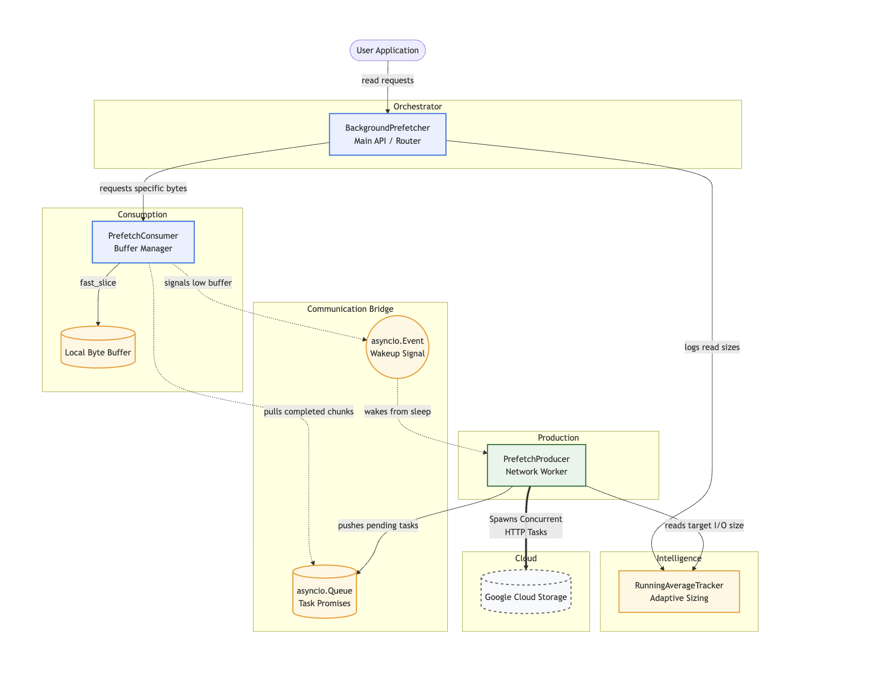
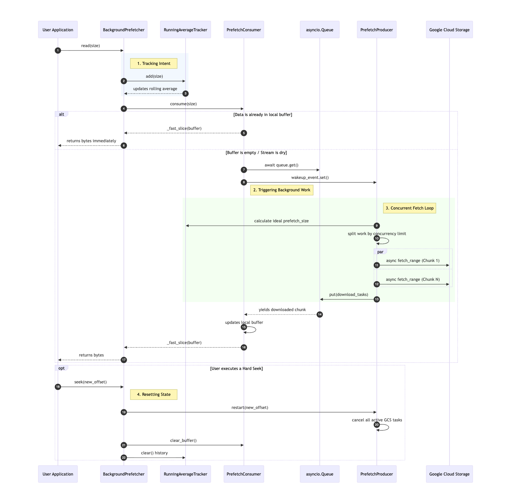

=================================================================
GCSFS Adaptive Concurrent Prefetching: Architecture & Usage Guide
=================================================================

Introduction to Prefetching in GCSFS
--------------------------------------------

When reading large files from cloud storage, the biggest bottleneck is network latency. If a program reads a chunk of a file, processes it, and then asks for the next chunk, the application spends most of its time idle, waiting for data packets to travel across the internet.

Prefetching solves this by predicting what data the application will need next and downloading it in the background before the application actually asks for it. By overlapping computation with network I/O, we can keep the application fed with data and significantly reduce total execution time.

Alongside this new prefetching architecture, native concurrency support for reads is now part of gcsfs. Previously, file reads were largely sequential. Now, gcsfs can download, or stream a file concurrently reducing the read time.

Inspiration
-------------------------------------------

The core concept of this implementation is inspired by the Linux kernel's file system prefetching algorithm (mm/readahead.c). Like the kernel, our system establishes a sliding window of data ahead of the user's current read position and utilizes asynchronous pipelining fetching tomorrow's data while the application processes today's to hide I/O latency.

However, a cloud object store operates in a fundamentally different physical environment than a local NVMe drive. We made some architectural changes to adapt the kernel's philosophy for Google Cloud Storage:

* **Base Operational Unit:** The Linux kernel is fundamentally tied to the hardware's virtual memory system, operating on tiny, fixed 4KB pages. In contrast, cloud read workloads (like pandas or Parquet) request data in massive, variable sizes. Instead of operating on a fixed 4KB hardware constraint, our prefetcher treats the user's actual requested byte size (the "I/O Size," which could be 100MB) as the fundamental block size for all background operations. We implemented a ``RunningAverageTracker`` that continuously monitors the size of the user's recent read requests and dynamically scales the prefetch window to match their actual behavior.
* **Trigger Mechanisms:** Because the kernel operates on small chunks, it can afford to wait. It can comfortably let the application consume several 64KB chunks before asynchronously triggering the next fetch, because reading those few chunks takes microseconds. However, because our base block size is massive, we cannot afford to wait. Waiting for multiple 100MB chunks to process before initiating the next network call would stall the application waiting on TCP/TLS handshakes. Therefore, we trigger prefetching immediately upon the consumption of the first block. As soon as the consumer pulls that first block, the background producer evaluates the buffer and proactively pushes the next chunk requests to ensure the pipeline never runs dry.

* **Scaling Strategy (Linear vs. Exponential):** The Linux kernel typically ramps its prefetch window by aggressively doubling it (e.g., 2x, 4x). While this works flawlessly for local NVMe hardware where fetching from disk is incredibly fast and the penalty for over-fetching is practically zero, we explicitly abandoned exponential doubling for the cloud. In cloud object storage, fetching data across the internet is inherently slow, and network bandwidth is finite and expensive. If an exponential strategy blindly doubles a massive 50MB base request and pulls 100MB of unused data across the network before the application halts, that waste isn't just discarded RAM, it is wasted API calls, inflated cloud egress costs, and consumed network bandwidth. Furthermore, dedicating maximum HTTP concurrency to aggressively download unproven data turns the prefetcher into a "noisy neighbor," saturating the network interface and starving the core application of bandwidth it might need for other critical operations. To strictly control both fetch costs and network noise, our system scales linearly using a simple multiplier (``sequential_streak * io_size``). This provides exactly enough background concurrency to effectively hide network latency without recklessly queuing up massive, expensive network requests that might ultimately be thrown away.

* **Network Multiplexing vs. Hardware Queues:** The Linux kernel breaks a readahead window into physical memory pages (e.g., 4KB) and pushes them down to the block layer, ultimately relying on the physical hardware controller's queues (like NVMe multi-queue) to execute the I/O in parallel. In the cloud, there is no hardware controller to manage our parallelism, and a single HTTP stream is heavily bandwidth-capped. To saturate the network, the prefetcher must manufacture its own parallelism in software. Our ``PrefetchProducer`` dynamically calculates a ``split_factor`` to multiplex the prefetch window into several concurrent HTTP Range requests. By orchestrating these independent network streams directly within the Python ``asyncio`` event loop, the prefetcher actively brute-forces the bandwidth ceiling that would otherwise choke a single HTTP connection.

How the Prefetching Components Work
-----------------------------------

The prefetching system is broken down into four distinct, decoupled components.

1. RunningAverageTracker (The Brain)
~~~~~~~~~~~~~~~~~~~~~~~~~~~~~~~~~~~~
This class tracks the sizes of the user's recent read requests using a sliding window (a deque of the last 10 reads). It calculates a rolling average of how much data the user typically asks for at a time. This average dictates the "I/O size" and tells the system how aggressively it should scale the prefetching window ensuring we don't fetch 100MB of data if the user is only reading 5KB at a time.

1. PrefetchProducer (The Network Worker)
~~~~~~~~~~~~~~~~~~~~~~~~~~~~~~~~~~~~~~~~
The producer is a background asyncio task responsible for calculating network strategy and communicating with GCS. It is designed to maximize bandwidth saturation while preventing memory bloat.

* **Adaptive Ramping:** It calculates the ``prefetch_size`` by multiplying the current I/O size by the user's sequential_streak (up to a calculated `max_prefetch_size`, defaulting to `min(256MB, max(2*io_size, 128MB)`). As the user proves they are reading sequentially, the producer fetches further ahead, otherwise would not prefetch anything.

* **Pipeline Throttling:** It pushes the resulting ``asyncio.Task`` promises into a shared queue. If the prefetch window is full (the distance between the user's offset and the producer's offset exceeds the calculated limit), the producer yields and goes to sleep, waking only when the consumer signals it needs more data.

* **Graceful Teardown:** When stopped, it safely iterates through all active network tasks, cancels them, and flushes the queue of unconsumed promises to guarantee zero memory leaks or dangling sockets.

3. PrefetchConsumer (The Consumer)
~~~~~~~~~~~~~~~~~~~~~~~~~~~~~~~~~~~~~~~~
The consumer lives closer to the user application. It is responsible for assembling the asynchronous chunks and serving exact byte requests to the user while keeping Python's Global Interpreter Lock (GIL) free.

* **GIL-Bypassing Memory Slices:** Native Python byte slicing (``buffer[start:end]``) on massive strings binds the GIL, blocking the entire application. To solve this, when the user requests data, the consumer delegates the byte extraction to ``_fast_slice`` via ``asyncio.to_thread``. This utilizes a C-level ``ctypes.memmove`` to slice the bytes in a background thread, completely bypassing the GIL and allowing the async event loop to keep fetching.

* **Proactive Wakeups:** The consumer monitors the ``sequential_streak``. As soon as the streak hits 2 (confirming a sequential read pattern), it preemptively triggers the wakeup_event for the producer, ensuring the network pipeline stays hot before the local buffer is actually empty.

* **Queue Management & Error Bubbling:** It awaits tasks from the shared queue. If a producer task encounters an exception (e.g., a GCS timeout or dropped connection), the consumer catches the injected exception from the queue, triggers an ``on_error`` callback, and cleanly aborts to prevent the user application from hanging.

4. BackgroundPrefetcher (The Orchestrator)
~~~~~~~~~~~~~~~~~~~~~~~~~~~~~~~~~~~~~~~~~~
This is the main public interface that ties everything together. It coordinates the producer and consumer, routes read requests, tracks user history, and provides thread-safe boundaries for synchronous Python code.

- **Thread-Safe Synchronous Bridging:** Because users often interact with gcsfs in a synchronous context (e.g., pandas.read_csv), the `_fetch` method uses a `threading.Lock()` and `fsspec.asyn.sync()` to safely pull data from the background asynchronous event loop into the main thread without race conditions.

- **Smart Seek Routing:** It intercepts every read request to determine the most efficient network action:

  - Soft Seek: If the user skips forward a small amount within the already-downloaded background buffer, the prefetcher simply advances the consumer's pointer (consumer.skip()). It instantly returns without dropping the network connections.

  - Hard Seek: If the user jumps entirely outside the downloaded buffer, the prefetcher resets the `RunningAverageTracker`, clears the buffers, halts the active producer tasks, and restarts the entire network stream at the new byte offset.

- **Global Error State:** If any background task fails, the prefetcher enters a strict `_error` state. Subsequent attempts to read immediately raise the trapped exception, preventing the orchestrator from deadlocking while waiting for a network task that has already died.

5. Flow
~~~~~~~~~
Here is the visual how these components interact with each other:

Interaction with GCSFile
------------------------

The prefetcher is seamlessly integrated into the ``GCSFile`` and ``GCSFileSystem`` object and replaces the standard sequential fetching mechanism when enabled.

Enabling the Feature
~~~~~~~~~~~~~~~~~~~~
To use this new architecture, set the following environment variables:

.. code-block:: bash

    export DEFAULT_GCSFS_CONCURRENCY=4
    export USE_EXPERIMENTAL_ADAPTIVE_PREFETCHING='true'

We recommend setting cache_type="none" to get the best results from this prefetch logic. The engine is smart enough to avoid prefetching if your workloads
are completely random. Other cache types create unnecessary copies that can slow down your performance.

Under the Hood Lifecycle
~~~~~~~~~~~~~~~~~~~~~~~~

* During ``GCSFile.__init__``, if the feature is enabled, a ``BackgroundPrefetcher`` instance is created and attached to ``self._prefetch_engine``. We map ``GCSFile._async_fetch_range`` directly to the prefetcher.
* When the user calls ``file.read(size)``, it internally calls ``GCSFile._fetch_range``.
* Instead of following the standard path, or making call directly, it delegates the request to ``self._prefetch_engine._fetch(start, end)``.
* The prefetcher immediately hands back the requested bytes from its local queue while the producer continues to pull the next chunks from GCS in the background.
* When the file is closed via ``file.close()``, it triggers ``_prefetch_engine.close()``, which safely cancels all pending network tasks, clears the memory buffers, and shuts down the background loops to prevent memory leaks.

Benchmarking with No Cache
-------------------------------------
Single Stream Performance (1 Process)
-------------------------------------
+---------+--------------+-----------------+-----------------+--------------------------+------------------+------------------+--------------------------+
| Pattern | IO Size (MB) | Default (MB/s)  | Concur. (MB/s)  | Prefetch+Concur. (MB/s)  | Default Mem (MB) | Concur. Mem (MB) | Prefetch+Concur Mem (MB) |
+=========+==============+=================+=================+==========================+==================+==================+==========================+
| seq     | 0.06         | 1.66            | 1.69            | 208.14                   | 150.07           | 150.24           | 244.43                   |
+---------+--------------+-----------------+-----------------+--------------------------+------------------+------------------+--------------------------+
| seq     | 1.00         | 23.69           | 23.43           | 658.71                   | 150.33           | 150.49           | 544.21                   |
+---------+--------------+-----------------+-----------------+--------------------------+------------------+------------------+--------------------------+
| seq     | 16.00        | 156.36          | 219.48          | 736.58                   | 174.31           | 209.91           | 622.55                   |
+---------+--------------+-----------------+-----------------+--------------------------+------------------+------------------+--------------------------+
| seq     | 100.00       | 205.48          | 416.17          | 507.18                   | 415.75           | 520.14           | 752.66                   |
+---------+--------------+-----------------+-----------------+--------------------------+------------------+------------------+--------------------------+
| rand    | 0.06         | 1.38            | 1.31            | 1.36                     | 151.05           | 151.03           | 151.00                   |
+---------+--------------+-----------------+-----------------+--------------------------+------------------+------------------+--------------------------+
| rand    | 1.00         | 18.01           | 19.49           | 18.84                    | 151.50           | 151.23           | 151.03                   |
+---------+--------------+-----------------+-----------------+--------------------------+------------------+------------------+--------------------------+
| rand    | 16.00        | 142.53          | 164.97          | 173.44                   | 175.44           | 195.93           | 192.45                   |
+---------+--------------+-----------------+-----------------+--------------------------+------------------+------------------+--------------------------+
| rand    | 100.00       | 201.72          | 394.35          | 399.80                   | 423.78           | 534.98           | 545.19                   |
+---------+--------------+-----------------+-----------------+--------------------------+------------------+------------------+--------------------------+

Multi Stream Performance (48 Process)
--------------------------------------
+---------+--------------+-----------------+-----------------+--------------------------+------------------+------------------+--------------------------+
| Pattern | IO Size (MB) | Default (MB/s)  | Concur. (MB/s)  | Prefetch+Concur. (MB/s)  | Default Mem (MB) | Concur. Mem (MB) | Prefetch+Concur Mem (MB) |
+=========+==============+=================+=================+==========================+==================+==================+==========================+
| seq     | 0.06         | 103.06          | 100.12          | 6427.04                  | 6395.91          | 6566.95          | 10260.48                 |
+---------+--------------+-----------------+-----------------+--------------------------+------------------+------------------+--------------------------+
| seq     | 1.00         | 1493.46         | 1457.01         | 14751.12                 | 6549.40          | 6381.80          | 19975.98                 |
+---------+--------------+-----------------+-----------------+--------------------------+------------------+------------------+--------------------------+
| seq     | 16.00        | 7321.71         | 10604.33        | 17088.18                 | 7596.40          | 8600.75          | 23418.01                 |
+---------+--------------+-----------------+-----------------+--------------------------+------------------+------------------+--------------------------+
| seq     | 100.00       | 8427.14         | 13033.72        | 15004.08                 | 14987.33         | 18409.79         | 23167.73                 |
+---------+--------------+-----------------+-----------------+--------------------------+------------------+------------------+--------------------------+
| rand    | 0.06         | 94.47           | 91.70           | 92.79                    | 6418.76          | 6397.77          | 6617.16                  |
+---------+--------------+-----------------+-----------------+--------------------------+------------------+------------------+--------------------------+
| rand    | 1.00         | 1233.89         | 1248.04         | 1269.04                  | 6358.52          | 6438.66          | 6525.85                  |
+---------+--------------+-----------------+-----------------+--------------------------+------------------+------------------+--------------------------+
| rand    | 16.00        | 6216.86         | 9286.27         | 9374.38                  | 7625.34          | 8519.78          | 8627.13                  |
+---------+--------------+-----------------+-----------------+--------------------------+------------------+------------------+--------------------------+
| rand    | 100.00       | 8932.10         | 12550.82        | 12968.84                 | 15041.77         | 18421.29         | 18508.52                 |
+---------+--------------+-----------------+-----------------+--------------------------+------------------+------------------+--------------------------+

Benchmarking with ReadAhead Cache
-------------------------------------
Single Stream Performance (1 Process)
-------------------------------------
+---------+--------------+-----------------+-----------------+--------------------------+------------------+------------------+--------------------------+
| Pattern | IO Size (MB) | Default (MB/s)  | Concur. (MB/s)  | Prefetch+Concur. (MB/s)  | Default Mem (MB) | Concur. Mem (MB) | Prefetch+Concur Mem (MB) |
+=========+==============+=================+=================+==========================+==================+==================+==========================+
| seq     | 0.06         | 78.16           | 86.38           | 523.89                   | 150.64           | 150.61           | 611.31                   |
+---------+--------------+-----------------+-----------------+--------------------------+------------------+------------------+--------------------------+
| seq     | 1.00         | 100.23          | 109.25          | 758.56                   | 150.46           | 150.50           | 578.07                   |
+---------+--------------+-----------------+-----------------+--------------------------+------------------+------------------+--------------------------+
| seq     | 16.00        | 139.03          | 187.91          | 586.25                   | 214.49           | 227.27           | 622.75                   |
+---------+--------------+-----------------+-----------------+--------------------------+------------------+------------------+--------------------------+
| seq     | 100.00       | 190.21          | 337.83          | 177.71                   | 600.24           | 634.02           | 799.69                   |
+---------+--------------+-----------------+-----------------+--------------------------+------------------+------------------+--------------------------+
| rand    | 0.06         | 0.91            | 0.86            | 0.93                     | 151.07           | 151.23           | 150.81                   |
+---------+--------------+-----------------+-----------------+--------------------------+------------------+------------------+--------------------------+
| rand    | 1.00         | 13.76           | 15.27           | 16.12                    | 150.89           | 150.59           | 151.14                   |
+---------+--------------+-----------------+-----------------+--------------------------+------------------+------------------+--------------------------+
| rand    | 16.00        | 115.72          | 168.69          | 166.08                   | 225.39           | 244.38           | 249.50                   |
+---------+--------------+-----------------+-----------------+--------------------------+------------------+------------------+--------------------------+
| rand    | 100.00       | 201.14          | 353.14          | 344.58                   | 532.25           | 640.24           | 646.37                   |
+---------+--------------+-----------------+-----------------+--------------------------+------------------+------------------+--------------------------+
Multi Stream Performance (48 Process)
--------------------------------------
+---------+--------------+-----------------+-----------------+--------------------------+------------------+------------------+--------------------------+
| Pattern | IO Size (MB) | Default (MB/s)  | Concur. (MB/s)  | Prefetch+Concur. (MB/s)  | Default Mem (MB) | Concur. Mem (MB) | Prefetch+Concur Mem (MB) |
+=========+==============+=================+=================+==========================+==================+==================+==========================+
| seq     | 0.06         | 3714.63         | 4836.03         | 13159.98                 | 6473.32          | 6451.69          | 23453.56                 |
+---------+--------------+-----------------+-----------------+--------------------------+------------------+------------------+--------------------------+
| seq     | 1.00         | 5181.51         | 5938.07         | 13595.90                 | 6558.29          | 6464.87          | 23465.71                 |
+---------+--------------+-----------------+-----------------+--------------------------+------------------+------------------+--------------------------+
| seq     | 16.00        | 6364.01         | 8241.61         | 8685.56                  | 9603.04          | 10482.20         | 26589.36                 |
+---------+--------------+-----------------+-----------------+--------------------------+------------------+------------------+--------------------------+
| seq     | 100.00       | 7933.12         | 9073.42         | 6559.75                  | 21102.71         | 24100.92         | 34867.50                 |
+---------+--------------+-----------------+-----------------+--------------------------+------------------+------------------+--------------------------+
| rand    | 0.06         | 49.31           | 50.49           | 55.03                    | 6470.39          | 6403.98          | 6513.27                  |
+---------+--------------+-----------------+-----------------+--------------------------+------------------+------------------+--------------------------+
| rand    | 1.00         | 753.51          | 796.78          | 891.93                   | 6379.23          | 6519.89          | 6293.09                  |
+---------+--------------+-----------------+-----------------+--------------------------+------------------+------------------+--------------------------+
| rand    | 16.00        | 5864.85         | 7647.61         | 7868.37                  | 10027.41         | 11680.56         | 11808.40                 |
+---------+--------------+-----------------+-----------------+--------------------------+------------------+------------------+--------------------------+
| rand    | 100.00       | 8276.16         | 10171.59        | 10172.54                 | 20621.17         | 23598.05         | 24086.18                 |
+---------+--------------+-----------------+-----------------+--------------------------+------------------+------------------+--------------------------+
